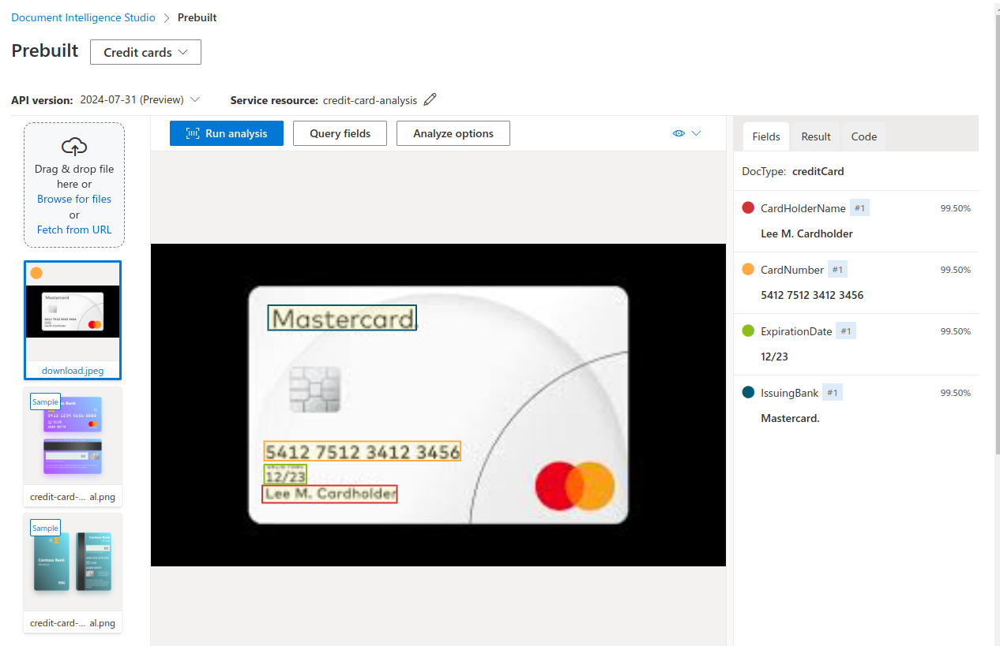

<h1>
<a href="https://www.dio.me/">
     </a>
    <span>Bootcamp Microsoft Certification Challenge #1 - AI 102</span>
</h1>


# :computer: Análise de Documentos Anti-fraude com AzureAI

Nesse projeto um recurso de Document Intelligence é criado no Azure e a API consumida com o modelo pré-construído para analise de dados de cartão de crédito.


# :bulb: Solução do Desafio

Criando o recurso:

<p align=center>

</p>

Testando no Studio com uma imagem baixada:

<p align=center>

</p>

## Consumindo a API com python

Copiei a chave do API e o endpoint para um arquivo `.env`. Os valores são acessados no código 

```python
from dotenv import load_dotenv
import os

load_dotenv()
key = os.environ.get('API_KEY')
endpoint = os.environ.get('ENDPOINT')
```

Instalando o pacote do document intelligence

O código está no arquivo `credit_card.ipynb`.

Função para analisar a imagem a partir de uma url:

```python
def analyze_credit_card(url):
    endpoint = os.environ.get('ENDPOINT')
    key = os.environ.get('API_KEY')
    document_intelligence_client = DocumentIntelligenceClient(
    endpoint=endpoint, credential=AzureKeyCredential(key))

    poller = document_intelligence_client.begin_analyze_document(
        "prebuilt-creditCard", AnalyzeDocumentRequest(url_source=url))

    card_info = poller.result()

    return card_info
```

Checando se os dados `CardHolderName`, `CardNumber`e `PaymentNetwork` existem, caso contrário retorna cartão inválido.

```python
def check_fields(card_info):
    data = {}
    for key, value in card_info.documents[0].fields.items():
        if key == "CardHolderName":
            data[key] = value.content
        elif key == "CardNumber":
            data[key] = value.content
        elif key == "PaymentNetwork":
            data[key] = value.content
        
    if len(data) != 3:
        return "Invalid Card"

    return data
```

Imprime a imagem e os dados:

```python
def display_card(url):

    urllib.request.urlretrieve(url, "card.png") 

    # Opening the image and displaying it (to confirm its presence) 
    img = Image.open(r"card.png") 
    display(img)

    card_info = analyze_credit_card(url)
    check_info = check_fields(card_info)
    if check_info == "Invalid Card":
        print(check_info)
    else:

        for key, value in check_info.items():
            print(f"{key}: {value}")
```

O arquivo card.png é sobrescrito toda vez que a função é executada por:

```python
 urllib.request.urlretrieve(url, "card.png") 
```

Exemplos de consultas:

<p align=center>


</p>

# Links úteis

[Get started with Document Intelligence](https://learn.microsoft.com/en-us/azure/ai-services/document-intelligence/quickstarts/get-started-sdks-rest-api?view=doc-intel-4.0.0&preserve-view=true&pivots=programming-language-python)

[Document Intelligence credit card model](https://learn.microsoft.com/en-us/azure/ai-services/document-intelligence/prebuilt/credit-card?view=doc-intel-4.0.0)

Open and display image: [geeksforgeeks](https://www.geeksforgeeks.org/how-to-download-an-image-from-a-url-in-python/)

