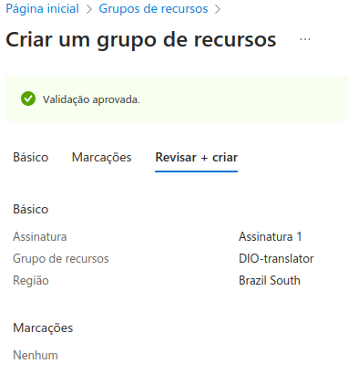
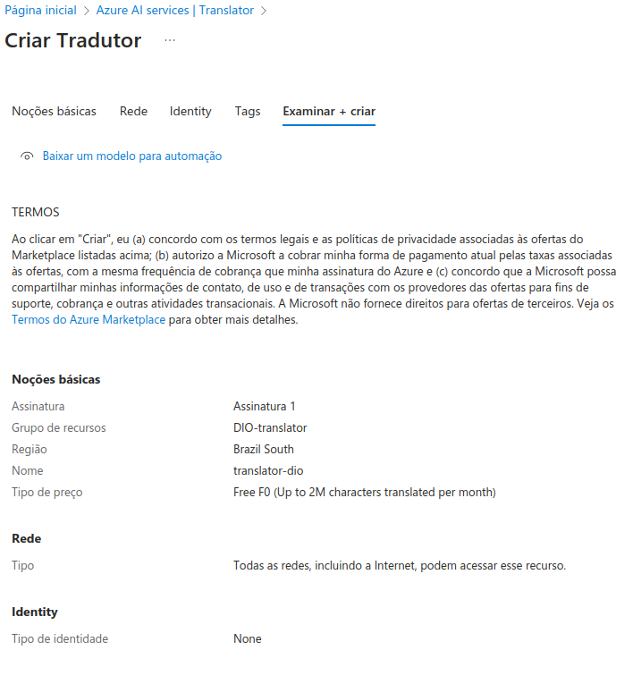
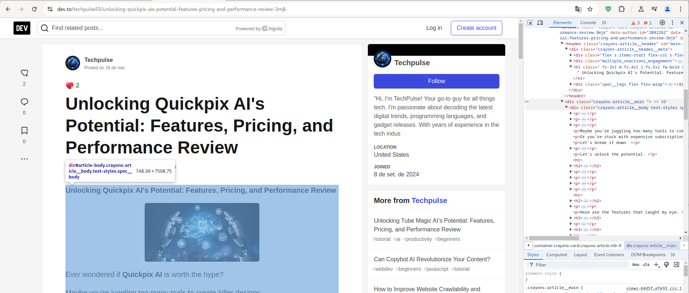

<h1>
<a href="https://www.dio.me/">
     </a>
    <span>Bootcamp Microsoft Certification Challenge #1 - AI 102</span>
</h1>


# :computer: Tradutor de Artigos Técnicos com AzureAI

Nesse projeto um recurso de tradutor é criado no Azure e a API consumida para traduzir um artigo obtido por Web scraping. 


# :bulb: Solução do Desafio

Criando o grupo de recurso:

<p align=center>

</p>

Criando o tradutor:

<p align=center>

</p>

Copiei a chave do API, o endpoint e a localização para um arquivo `.env`.

E acesso os valores no código (arquivo `translator.ipynb`)

```python
from dotenv import load_dotenv
import os

load_dotenv()
key = os.environ.get('API_KEY')
endpoint = os.environ.get('TEXT_ENDPOINT')
location = os.environ.get('LOCATION')
```

Utilizando o exemplo de código do Azure:

```python
import requests, uuid, json

# Add your key and endpoint
key = "<your-translator-key>"
endpoint = "https://api.cognitive.microsofttranslator.com"

# location, also known as region.
# required if you're using a multi-service or regional (not global) resource. It can be found in the Azure portal on the Keys and Endpoint page.
location = "<YOUR-RESOURCE-LOCATION>"

path = '/translate'
constructed_url = endpoint + path

params = {
    'api-version': '3.0'
    'from': 'en'
    'to': ['fr', 'zu']
}

headers = {
    'Ocp-Apim-Subscription-Key': key
    # location required if you're using a multi-service or regional (not global) resource.
    'Ocp-Apim-Subscription-Region': location
    'Content-type': 'application/json'
    'X-ClientTraceId': str(uuid.uuid4())
}

# You can pass more than one object in body.
body = [{
    'text': 'I would really like to drive your car around the block a few times!'
}]

request = requests.post(constructed_url, params=params, headers=headers, json=body)
response = request.json()

print(json.dumps(response, sort_keys=True, ensure_ascii=False, indent=4, separators=(',', ': ')))
```
Testei a tradução e vi que a conexão com a API estava ok:

```json
[
    {
        "translations": [
            {
                "text": "Eu realmente gostaria de dirigir seu carro ao redor do quarteirão algumas vezes!",
                "to": "pt"
            }
        ]
    }
]
```

Então defini uma função para retornar somente o texto traduzido:

```python
def text_translator(text):
    
    path = '/translate'
    endpoint = os.environ.get('TEXT_ENDPOINT')
    constructed_url = endpoint + path

    params = {
        'api-version': '3.0',
        'from': 'en',
        'to': ['pt-br']
    }

    headers = {
        'Ocp-Apim-Subscription-Key': key,
        # location required if you're using a multi-service or regional (not global) resource.
        'Ocp-Apim-Subscription-Region': location,
        'Content-type': 'application/json',
        'X-ClientTraceId': str(uuid.uuid4())
    }

    # You can pass more than one object in body.
    body = [{
        'text': text
    }]

    request = requests.post(constructed_url, params=params, headers=headers, json=body)
    response = request.json()

    return response[0]['translations'][0]['text']
```

Vou traduzir o artigo do [link](https://dev.to/techpulse55/unlocking-quickpix-ais-potential-features-pricing-and-performance-review-3mjk).

Inspecionando o html da página:

<p align=center>

</p>

Extraí somente o texto do artigo:

```python
article_text = soup.main.find_all('div', {'class': 'crayons-article__body'})[0].text
```

E gerei a tradução que pode ser vista no arquivo translation.txt

```python
# Traduzindo
translation = text_translator(article_text)
# Salvando o arquivo
text_file = open("translation.txt", "w")
text_file.write(translation)
text_file.close()
```